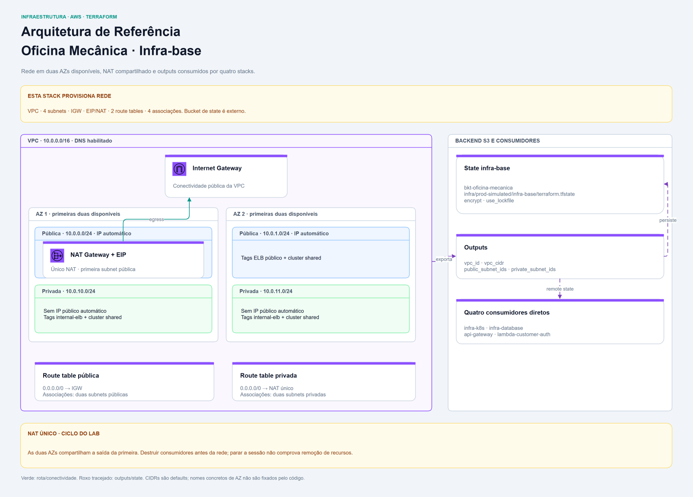

<div align="center">

# ☁️ Oficina Mecânica — Infraestrutura Base AWS (IaC)

**Provisionamento automatizado da fundação de rede e infraestrutura na AWS com Terraform para a solução Oficina Mecânica.**


</div>

## 📋 Sobre

Este repositório contém o código de **Infraestrutura como Código (IaC)** responsável pelo provisionamento de toda a fundação de rede em nuvem na AWS para a aplicação **Oficina Mecânica**.

Faz parte do ecossistema de serviços e infraestrutura da pós-graduação em Arquitetura de Software da FIAP (turma 15SOAT).

A [API](https://github.com/FIAP-15SOAT/oficina-mecanica-api) é a entrada central da documentação da solução.

---

### 🏗️ Recursos Provisionados

1. **Rede e Conectividade (`networking.tf`)**:
   - **VPC** dedicada com bloco CIDR padrão `10.0.0.0/16`, com suporte a DNS interno habilitado (`enable_dns_support` e `enable_dns_hostnames`).
   - **Subnets Públicas**: `10.0.0.0/24` e `10.0.1.0/24`, com `map_public_ip_on_launch = true` e tags para integração com ELBs públicos (`kubernetes.io/role/elb = 1`). Cada subnet fica em uma das primeiras duas AZs disponíveis na região configurada; os nomes das AZs não são fixos.
   - **Subnets Privadas**: `10.0.10.0/24` e `10.0.11.0/24`, nas mesmas duas AZs, sem atribuição automática de IP público e com tags para ELBs internos (`kubernetes.io/role/internal-elb = 1`). Os dois conjuntos também recebem a tag compartilhada do cluster `eks-oficina-mecanica`.
   - **Internet Gateway (IGW)** para a saída das subnets públicas e **um NAT Gateway**, com Elastic IP na primeira subnet pública, para a saída à internet das duas subnets privadas. A criação do NAT depende do IGW.
   - **Tabelas de roteamento**: uma pública, com rota `0.0.0.0/0` para o IGW, e uma privada, com rota `0.0.0.0/0` para o NAT. Cada tabela tem duas associações, uma por subnet do seu conjunto.

Os CIDRs são configuráveis. `locals.tf` seleciona apenas as primeiras duas AZs
e os primeiros dois CIDRs de cada lista; CIDRs adicionais não criam outras
subnets. O provider aplica as tags `Project`, `ManagedBy` e `Environment`.
As tags Kubernetes identificam as subnets para integração, mas não criam
balanceadores por si mesmas.

Esta stack provisiona a rede compartilhada. EKS, RDS, Lambda, API Gateway e seus
Security Groups pertencem aos repositórios consumidores. O NLB da API é
**interno**, nas subnets privadas, e é provisionado pela infraestrutura
Kubernetes. Bucket de state, roles IAM, NACLs customizadas, Flow Logs e VPC
Endpoints não são criados por este módulo.



---

## 📁 Estrutura do Repositório

```text
.
├── .github/
│   └── workflows/
│       ├── cd.yml  # Apply na main, controlado por ENABLE_DEPLOY ou disparo manual
│       └── ci.yml  # Valida Terraform e abre PR; plan condicionado a credenciais
├── docs/
│   ├── adr/
│   │   ├── 0001-escolha-de-nuvem-e-infra-base.md
│   │   ├── 0002-postura-de-rede-apenas-security-groups.md
│   │   └── 0003-ci-tolerante-a-indisponibilidade-do-lab.md
│   ├── diagrams/
│   │   ├── cd-workflow.png  # Job e steps do workflow de CD
│   │   ├── ci-workflow.png  # Jobs e steps do workflow de CI
│   │   └── infrastructure.png  # Arquitetura do componente
│   └── ci-cd.md  # Jobs, steps, conditions e diagramas de CI/CD
├── terraform/
│   ├── .terraform.lock.hcl  # Versões e checksums dos providers
│   ├── backend.tf  # Backend S3 e lock nativo
│   ├── locals.tf  # Seleção/convenções locais de recursos
│   ├── networking.tf  # VPC, AZs, subnets, IGW, NAT, rotas e associações
│   ├── outputs.tf  # Outputs de integração
│   ├── providers.tf  # Providers e leitura de remote state quando aplicável
│   ├── terraform.tfvars  # Configuração versionada do laboratório
│   ├── terraform.tfvars.example  # Referência para configurar o ambiente
│   └── variables.tf  # Variáveis de entrada
├── .gitignore  # Arquivos locais ignorados
└── README.md  # Entrada do componente e guia local
```

---

## 💾 Estado Remoto (Remote State)

O estado do Terraform é armazenado remotamente em um bucket S3 com criptografia
em repouso e suporte ao **lock nativo do S3** (`use_lockfile = true`):

- **Bucket**: `bkt-oficina-mecanica`
- **Chave (Key)**: `infra/prod-simulated/infra-base/terraform.tfstate`
- **Região**: `us-east-1`

O bucket deve existir previamente. A identidade AWS precisa ler/gravar o state
e criar/remover o lockfile. Bucket e key são identificadores estáveis,
compartilhados com os consumidores; não são renomeados junto dos repositórios.

Os outputs são consumidos diretamente via `data.terraform_remote_state`:

| Consumidor | Uso |
| --- | --- |
| [Infraestrutura Kubernetes](https://github.com/FIAP-15SOAT/oficina-mecanica-infra-k8s) | VPC/CIDR; subnets privadas para nodes/NLB e públicas + privadas associadas ao EKS |
| [Infraestrutura de database](https://github.com/FIAP-15SOAT/oficina-mecanica-infra-database) | VPC/CIDR e subnets privadas para o RDS |
| [API Gateway](https://github.com/FIAP-15SOAT/oficina-mecanica-api-gateway) | VPC/CIDR e subnets privadas para o VPC Link |
| [Lambda de autenticação](https://github.com/FIAP-15SOAT/oficina-mecanica-lambda-customer-auth) | VPC e subnets privadas para a função |

O monitoramento consome o state do Gateway, sem leitura direta deste state.

---

## ⚙️ Variáveis e Saídas

### Principais Variáveis de Entrada

| Variável | Tipo | Default | Descrição | Uso |
| --- | --- | --- | --- | --- |
| `aws_region` | `string` | `us-east-1` | Região da AWS | Região dos recursos |
| `project_name` | `string` | `oficina-mecanica` | Prefixo usado para nomes de recursos e tags | Compõe nomes e tags |
| `environment` | `string` | `prod-simulated` | Ambiente de implantação | Tag Environment |
| `vpc_cidr` | `string` | `10.0.0.0/16` | Bloco CIDR da VPC | CIDR da VPC |
| `public_subnet_cidrs` | `list(string)` | `["10.0.0.0/24", "10.0.1.0/24"]` | CIDRs das subnets públicas (mínimo 2) | Ao menos dois CIDRs; somente os primeiros dois são usados |
| `private_subnet_cidrs` | `list(string)` | `["10.0.10.0/24", "10.0.11.0/24"]` | CIDRs das subnets privadas (mínimo 2) | Ao menos dois CIDRs; somente os primeiros dois são usados |

---

### Saídas Exportadas (Outputs)

| Output | Descrição | Uso |
| --- | --- | --- |
| `vpc_id` | ID da VPC criada | VPC para SGs e integrações dos consumidores |
| `vpc_cidr` | Bloco CIDR da VPC | CIDR usado nas regras de acesso |
| `private_subnet_ids` | IDs das subnets privadas | Subnets de nodes EKS, RDS, VPC Link e Lambda |
| `public_subnet_ids` | IDs das subnets públicas | Subnets também associadas ao control plane EKS |

---

## 🚀 Como Executar Localmente

### Pré-requisitos

- **Terraform ≥ 1.11.0**.
- **AWS provider ≥ 6.46.0 e < 7.0.0**; as versões/checksums instalados ficam em `terraform/.terraform.lock.hcl`.
- **AWS CLI v2** configurada com as três credenciais temporárias do AWS Academy: access key, secret key e session token (`aws configure`).
- Acesso ao bucket de state S3 (`bkt-oficina-mecanica`) e permissões para os recursos de rede.
- Valores de `terraform.tfvars` revisados; a referência é `terraform.tfvars.example`. Não substitua um arquivo existente sem revisar seus valores.

### Passo a Passo

```bash
# 1. Clonar o repositório
git clone https://github.com/FIAP-15SOAT/oficina-mecanica-infra-base.git

# 2. Entrar no diretório que contém a configuração Terraform
cd oficina-mecanica-infra-base/terraform

# 3. Inicializar os providers e o backend S3 configurado
terraform init

# 4. Verificar a formatação sem modificar arquivos
terraform fmt -check -recursive

# 5. Validar a sintaxe e a consistência da configuração
terraform validate

# 6. Visualizar o plano de execução, incluindo as consultas AWS necessárias
terraform plan

# 7. Aplicar o provisionamento após revisar o plano exibido
terraform apply

# 8. Consultar os outputs para integrar os repositórios consumidores
terraform output
```

### Validação estática, sem sessão AWS ativa

Na pasta `terraform/`, é possível verificar a configuração sem inicializar o
backend ou consultar recursos AWS:

```bash
# Verificar a formatação da configuração e de seus subdiretórios
terraform fmt -check -recursive

# Instalar os providers sem conectar ao backend remoto
terraform init -backend=false

# Validar a configuração usando os schemas dos providers instalados
terraform validate
```

A instalação exige acesso ao registry ou a um cache local. Quando já houver
lockfile e for necessário preservar suas versões/checksums, acrescente
`-lockfile=readonly` ao `init`. Antes de um plan remoto após essa inicialização,
use `terraform init -reconfigure` para configurar o backend. `validate` não
comprova permissões AWS nem o resultado de um plan.

### Ordem de provisionamento e encerramento do laboratório

- Provisione **infra-base primeiro**, antes de Kubernetes e database. O Gateway também depende do Kubernetes; a Lambda depende dos states de rede, banco e Gateway.
- Remova primeiro os consumidores e workloads dependentes. Mantenha o EKS acessível enquanto seus recursos Helm/Kubernetes forem removidos.
- Destrua **infra-base por último**, com credenciais válidas:

```bash
# Revisar os recursos que serão removidos
terraform plan -destroy

# Remover a rede após encerrar seus consumidores
terraform destroy
```

NAT Gateway, Elastic IP público e tráfego/processamento de rede podem consumir
crédito enquanto existem. Compartilhar um NAT reduz a quantidade de recursos,
mas concentra a saída na primeira AZ; duas AZs não tornam esse caminho
redundante. Encerrar a sessão do lab não comprova a remoção dos recursos. O
bucket de state é externo à stack e não é destruído por ela. Não há workflow
de destroy neste repositório.

---

## 🔄 Pipelines de CI/CD

O repositório conta com dois workflows automatizados via GitHub Actions:

- **CI**: push em `feature/**` e `fix/**`; valida Terraform, faz plan quando a autenticação AWS está disponível e abre PR para `main` com GitHub App.
- **CD**: push em `main` ou `workflow_dispatch`; executa plan/apply sob `production`, com gate por `main` e `ENABLE_DEPLOY` ou disparo manual. Não há dependência `needs` entre os dois workflows.

A [documentação de CI/CD](docs/ci-cd.md) explica cada job/step, conditions, autenticação, configuração GitHub e falhas, e **renderiza os diagramas de CI e CD**.

---

## 📐 Decisões Arquiteturais

- [ADR 0001 — Escolha da nuvem (AWS) e criação da infraestrutura de rede base](docs/adr/0001-escolha-de-nuvem-e-infra-base.md)
- [ADR 0002 — Controle de tráfego só por Security Groups, sem NACLs nem VPC Flow Logs](docs/adr/0002-postura-de-rede-apenas-security-groups.md)
- [ADR 0003 — CI tolerante à indisponibilidade do ambiente AWS Academy](docs/adr/0003-ci-tolerante-a-indisponibilidade-do-lab.md)

## 👥 Autores

- [Guilherme da Rocha Salvador](https://github.com/guilhermesalvador404)
- [Lucas Almeida da Silva](https://github.com/lucas-almeida-silva)
- [Ramoon Lincoln Barros Camacho](https://github.com/ramooncamacho)
- [Renan Santana Camacho](https://github.com/renancamacho)

## 📄 Licença

Projeto acadêmico (FIAP — 15SOAT), para fins educacionais. Sem licença aberta declarada (`UNLICENSED`).

